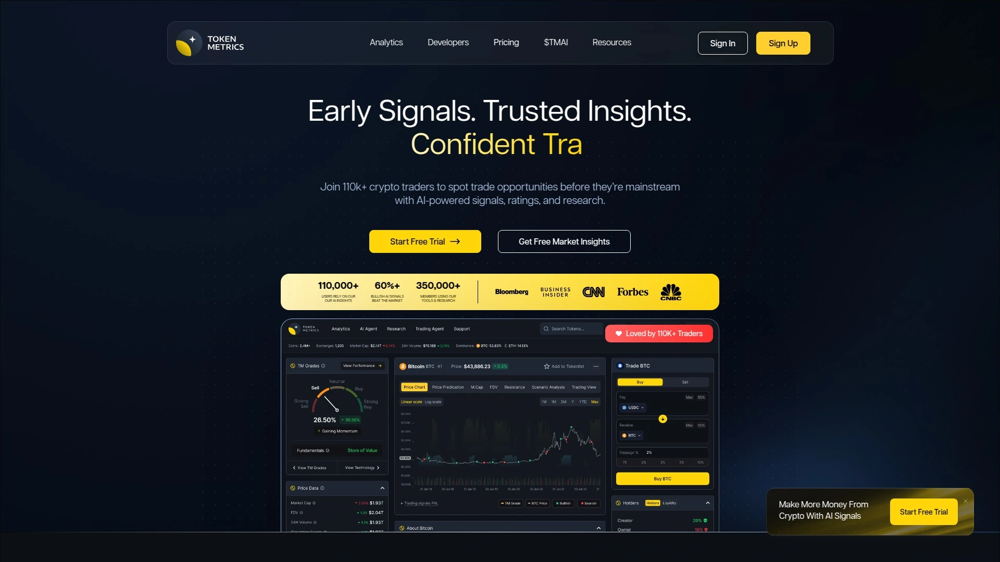

# 2025's Top 12 Best Crypto Trading Bot Platforms

The crypto market never sleeps, but you probably should. Missing a pump because you were catching some rest or watching prices tank while you're stuck in a meeting feels terrible, especially when you know the pattern was predictable. Automated crypto trading bots solve this by executing your strategies 24/7, catching opportunities the moment they appear and cutting losses before they spiral.

These platforms transform complex trading logic into visual rules you configure without touching a single line of code. Whether you're running dollar-cost averaging to smooth out volatility, grid bots to profit from sideways markets, or signal-based strategies triggered by technical indicators, the right trading bot handles execution while you focus on strategy. Finding tools that balance ease of use with genuine power makes the difference between automated stress and automated success.

## **[Coinrule](https://coinrule.com)**

Code-free automation across 10+ exchanges with demo trading built in.

Coinrule lets you build automated trading strategies through an intuitive interface where you drag conditions and actions into place without writing any code. The platform connects to major exchanges including Binance, Coinbase, Kraken, KuCoin, OKX, and Bybit, plus onchain trading via Base, Arbitrum, and Ethereum networks. Your private keys and withdrawal permissions stay entirely with you—Coinrule only gets read and trade execution access through limited API connections.

**Strategy building made visual:** You create rules from scratch or choose from pre-built templates that have real trading history behind them. Each rule follows an if-this-then-that logic: when market conditions you specify are met, the bot executes the trades you've configured. Demo trading lets you test strategies against real market data before risking actual funds, showing exactly how your approach would perform.

The platform works around the clock, catching opportunities even while you sleep. You can automate taking profits at target levels, protect your portfolio with stop losses, and jump into trending coins the moment conditions align. Free trading signals come included, helping you spot market movements worth acting on.

**Pricing structure:** The free plan lets you manage your portfolio and test basic automation forever. Hobbyist plans start at $29.99 monthly, Trader at $59.99, scaling up to Pro at $449.99 for advanced features and higher trading volumes. The 30-day free trial gives you full access to see if automated trading fits your style.

Coinrule particularly suits beginners who want to automate strategies without learning programming, plus intermediate traders who prefer visual rule builders over complex configuration screens. The balance between simplicity and capability means you spend less time figuring out the platform and more time refining your approach.

## **[3Commas](https://3commas.io)**

Comprehensive bot suite with SmartTrade terminal and marketplace strategies.

3Commas delivers one of the most feature-rich crypto trading environments available, supporting over 20 major exchanges including Binance, Coinbase Pro, Kraken, and Bitfinex. The platform operates entirely cloud-based, meaning bots run continuously without requiring your computer to stay powered on.

**Bot variety and flexibility:** DCA bots average your entry prices across multiple purchases to smooth volatility impact. Grid bots profit from sideways price action by placing buy and sell orders at incremental levels, capturing small gains repeatedly. Signal bots integrate with TradingView to execute trades based on custom indicators and strategies you design there. The SmartTrade terminal provides granular control over individual trades with trailing take profit, trailing stop loss, and multiple take profit targets.

Multi-pair bots monitor over 100 trading pairs simultaneously, jumping on whichever opportunities meet your conditions first. The marketplace lets you access strategies created by experienced traders, though you'll want to backtest any strategy before deploying real capital.

**Risk management emphasis:** Backtesting runs your strategy against up to one year of historical 1-minute data, showing performance across different market conditions. Paper trading simulates strategies in real-time using current markets without risking funds. 3Commas never gets withdrawal access to your exchange accounts—it can only read data and execute trades you've authorized.

Plans include a Free tier with limited features, Pro at $49 monthly, and Expert at $79 monthly unlocking full bot capabilities. The mobile app extends control to iOS and Android devices. Customer reviews consistently highlight the platform's depth and the learning curve that comes with it.

## **[Cryptohopper](https://www.cryptohopper.com)**

Strategy marketplace with AI-enhanced scanning and drag-and-drop design.

Cryptohopper operates entirely in the cloud, executing trades 24/7 without requiring any software installed on your devices. The platform supports 16+ exchanges including Binance, KuCoin, Kraken, Coinbase Pro, and Poloniex.

The visual strategy designer uses drag-and-drop logic to build trading rules based on technical indicators like RSI, MACD, EMA, and Bollinger Bands. You can configure indicator-driven strategies, arbitrage between exchanges, scalping configurations, or swing trading setups without coding. Algorithmic Intelligence (AI) automatically backtests multiple strategies you feed it, rates their performance, and selects the most effective one for current conditions.

**Marketplace ecosystem:** The strategy marketplace offers both free and paid strategies created by other traders. External signal providers can trigger your bot to enter or exit positions based on their analysis. Templates provide starting points you customize rather than building from scratch.

Paper trading environments let you practice without financial risk. Arbitrage tools identify price discrepancies across exchanges. Portfolio management features track performance across multiple bots and exchanges from one dashboard.

Pricing starts with a Pioneer free plan for learning the platform, then Explorer at $24.16 monthly, Adventurer at $57.50, and Hero at $107.50 with premium features and AI scanning. The platform suits intermediate to advanced traders who appreciate flexibility between custom configuration and pre-built marketplace content.

## **[Pionex](https://www.pionex.com)**

Built-in exchange with 12 free trading bots and lowest fees.

Pionex differs from other platforms by functioning as both an exchange and a bot provider. This integration means you're not connecting external exchange accounts—you trade directly on Pionex using their built-in automation. The platform charges among the lowest trading fees in the industry at just 0.05%, significantly cheaper than most competitors.

**Twelve pre-configured bots** come included for free, eliminating subscription costs entirely. Grid trading bots, DCA bots, arbitrage bots, and specialized strategies like Infinity Grid and Reverse Grid handle different market scenarios. Each bot includes straightforward configuration—you set parameters like price ranges and investment amounts, then let it run.

The simplified approach makes Pionex ideal for beginners wanting to experiment with automated trading without monthly fees or complex setup. Pre-configured bots mean less customization than advanced platforms but faster deployment and easier understanding.

Pionex supports 35+ cryptocurrencies and accepts only crypto deposits, not fiat currency. The platform has over 100,000 active users and launched in 2017 with a bot-first philosophy. Mobile apps for iOS and Android provide full functionality.

## **[Bitsgap](https://bitsgap.com)**

AI-powered portfolio management across 15+ exchanges with futures support.

Bitsgap provides an all-in-one trading terminal connecting 15+ leading exchanges through a single interface. The AI Assistant curates optimized bot portfolios by analyzing market conditions and recommending configurations likely to perform well.

**Comprehensive bot lineup:** Grid bots capture profits from sideways volatility. DCA bots average entry prices to reduce timing risk. BTD (Buy The Dip) bots catch sudden price drops. COMBO bots combine DCA and Grid strategies for futures trading with leverage. LOOP bots automatically reinvest profits for compound growth.

Smart algorithmic orders execute complex multi-leg trades. The professional-grade trading terminal provides advanced charting, order types, and portfolio tracking. Both spot and futures trading are supported across connected exchanges.

Backtesting shows how strategies would have performed historically. Demo mode lets you practice with simulated funds. The platform updates continuously with new features and exchange integrations.

Plans start with Basic at $22 monthly, Advanced at $51, and Pro at $111 for maximum features and concurrent bots. Bitsgap suits serious traders who want unified management across multiple exchanges plus advanced automation.

## **[TradeSanta](https://tradesanta.com)**

Quick setup cloud bots with long and short strategies.

TradeSanta focuses on ease of use and rapid deployment, letting you launch cloud-based trading bots in minutes. The platform runs continuously without requiring your computer to stay online, executing strategies across 9 supported exchanges.

You can configure both long strategies (buying low, selling high) and short strategies (selling high, buying back low) using the same bot. Custom indicators and strategy templates provide flexibility while maintaining simplicity. Technical indicators like moving averages, RSI, and MACD trigger entry and exit points.

The interface prioritizes getting bots running over extensive customization. Templates for common strategies reduce setup time. Performance tracking shows which bots generate profits and which need adjustment.

Pricing includes Basic at $18 monthly, Advanced at $32, and Maximum at $45 with increasing numbers of active bots and features. TradeSanta appeals to traders wanting straightforward automation without overwhelming options.

## **[Altrady](https://www.altrady.com)**

Multi-exchange platform with customizable bots and base scanning.

Altrady connects 19 exchanges through one comprehensive trading interface. The platform combines manual trading capabilities with automated bot execution, serving traders who want both options available.

Customizable trading bots execute strategies you configure based on your preferred indicators and conditions. Base scanning tools identify coins with specific technical characteristics or momentum patterns. Portfolio tracking consolidates holdings across all connected exchanges into unified views.

The platform emphasizes trader education and community features alongside automation. Pricing ranges from free tier to $89 monthly for professional features. Altrady suits traders managing accounts across multiple exchanges who want integrated tools rather than switching between platforms.

## **[Mizar](https://mizar.com)**

Social copy-trading platform with volatility bots and smart money tracking.

Mizar combines automated trading with social copy-trading features, letting you both run your own bots and replicate strategies from successful traders. The platform supports 11 exchanges and uses a per-trade fee structure ranging from 0.0047% to 0.1% instead of monthly subscriptions.

**Unique volatility bot:** The platform offers specialized bots that monitor hot tokens ranked by 24-hour trading volume or smart money net inflow. When whitelisted tokens drop by your specified percentage, the bot snipes the purchase and waits for the bounce. This automated dip-buying approach aims to catch reversals in volatile coins.

Copy-trading lets you follow experienced traders' strategies automatically, with their trades executed in your account based on proportional allocation. The social component includes leaderboards showing top performers.

Mizar's backers include Nexo, KuCoin Labs, Huobi Ventures, MEXC Global, gate.io Labs, and Woo Ventures. The MZR token provides access to advanced trading tools and social features. Mizar works well for traders interested in both automation and learning from successful community members.

## **[HaasOnline](https://www.haasonline.com)**

Advanced platform with HaasScript for custom algorithm development.

HaasOnline targets experienced traders and developers who want complete control over bot logic through custom coding. The platform supports 15+ exchanges and provides tools far beyond standard pre-configured bots.

HaasScript, the platform's proprietary scripting language, lets advanced users write custom trading algorithms from scratch. For those preferring visual design, drag-and-drop strategy builders create complex logic without code. The platform includes swing trading bots, scalping bots, market-making bots, and arbitrage bots.

**Professional-grade tools:** Backtesting simulates strategies using historical data to evaluate profitability potential. Paper trading runs strategies in real-time using current markets without risking capital. Advanced charting and technical analysis support strategy development.

Security features include two-factor authentication and encrypted API connections. The platform never stores your funds—all assets remain on connected exchanges.

Pricing includes Lite+ at $7.50 monthly, Standard at $40.83, and Pro at $82.50 for full feature access and unlimited bots. HaasOnline suits algorithmic traders, quant strategists, and developers who want maximum customization.

## **[Zignaly](https://zignaly.com)**

Copy-trading platform with TradingView integration and signal providers.

Zignaly emphasizes copy-trading where you automatically replicate trades from professional signal providers. The platform offers various signal providers to choose from, each with different trading styles and historical success rates.

TradingView integration enables tracking performance, setting alerts, and receiving market insights in real-time. You can follow strategies from experienced traders while learning their approaches. The platform aligns interests through its structure—signal providers succeed when you succeed.

Automated trading bots execute strategies based on specific market conditions and technical indicators beyond just copy-trading. The platform provides flexible pricing with a free plan offering limited copy-trading access. Paid plans start around $14.99 monthly with unlimited copy-trading and additional features.

Zignaly suits traders who want to learn from professionals while automating their execution.

## **[Hummingbot](https://hummingbot.org)**

Open-source framework for professional market makers and developers.

Hummingbot stands apart as an open-source framework rather than a hosted service, giving complete code access and customization freedom. The platform serves professional market makers, algorithmic traders, and developers building custom strategies.

The framework supports market-making strategies, arbitrage, and directional trading through modular architecture. Connections extend to 40+ exchanges including both centralized and decentralized platforms. Users modify open-source code to create highly customized strategies.

**Professional tools:** Quants Lab handles quantitative trading research, data collection, backtesting, and automated task scheduling. Hummingbot API serves as a command center for managing multiple bot instances. The framework fetches market data and enables sophisticated backtesting.

Hummingbot remains completely free as open-source software. The WebSocket connector architecture receives praise for accessibility. Community members report generating billions in trading volume using Hummingbot strategies.

The platform requires technical expertise—you'll need programming knowledge to leverage its full capabilities. It's ideal for serious algorithmic traders and market makers who want control over every aspect of their trading infrastructure.

## **[Token Metrics](https://www.tokenmetrics.com)**

AI-powered analytics platform with trading signals and bot integration.

Token Metrics differs from traditional bot platforms by providing AI-powered crypto analytics and trading intelligence rather than bot execution itself. The platform offers Trader and Investor Grades that score tokens using AI, bullish and bearish signals, portfolio strategies via AI indices, and custom alerts.

**Data-driven approach:** The platform analyzes vast datasets including price charts, market sentiment, technical indicators, social media trends, and on-chain activity to generate trading signals and predictions. Predictive analytics forecast token performance. Real-time signals trigger based on pattern recognition. Sentiment analysis monitors Twitter, Reddit, and news feeds.

Traders use Token Metrics alongside exchanges or integrate its API with their own trading bots for AI-informed decision making. The Data API enables building custom bots that leverage Token Metrics intelligence. Recent Cline integration allows developers to build AI-powered bots through natural language prompts.

Token Metrics bridges the gap between raw market data and actionable trading decisions. It works best combined with execution platforms—you use Token Metrics for analysis and signals, then execute via exchanges or bot platforms. The platform serves both beginners seeking guidance and professionals running algorithmic strategies.

## FAQ

**Do crypto trading bots actually work in all market conditions?**

Bots execute strategies consistently without emotion, but no bot guarantees profits in every situation. Different bot types suit different conditions—grid bots excel in sideways markets, DCA bots smooth volatile downturns, and signal bots can adapt to changing trends if configured properly. Success depends on choosing strategies that match current market behavior and adjusting when conditions shift. Always backtest strategies and start with small amounts to verify performance before scaling up.

**How much coding knowledge do I need to use these platforms?**

Most modern trading bot platforms require zero coding skills, using visual builders where you drag conditions and configure settings through interfaces. Platforms like Coinrule, 3Commas, and Pionex specifically target non-programmers with no-code automation. Advanced platforms like HaasOnline and Hummingbot offer coding capabilities for those who want them, but even these provide visual alternatives. Start with beginner-friendly platforms if you're new to automation.

**What's the difference between cloud-based and self-hosted trading bots?**

Cloud-based bots like Cryptohopper and 3Commas run on provider servers, meaning your strategies execute 24/7 without your computer needing to stay on. Self-hosted solutions like Hummingbot require you to run software on your own infrastructure, giving more control but demanding technical expertise. Most traders prefer cloud solutions for convenience unless they have specific requirements around data privacy or customization that justify self-hosting.

## Making Automation Work

The crypto trading bot landscape has matured into platforms serving everyone from first-time automators to quantitative developers building custom algorithms. Your ideal choice depends on whether you prioritize ease of use over customization depth, prefer monthly subscriptions or usage-based fees, and need multi-exchange management or are comfortable trading on a single platform.

For traders seeking the best balance of accessibility and capability without coding requirements, [Coinrule](https://coinrule.com) delivers visual strategy building that works across major exchanges with demo trading built in from day one. The platform's if-this-then-that logic makes complex automation understandable while maintaining the power to execute sophisticated strategies, making it particularly effective for beginners graduating to intermediate trading and experienced traders who value time-to-deployment over endless configuration options.
